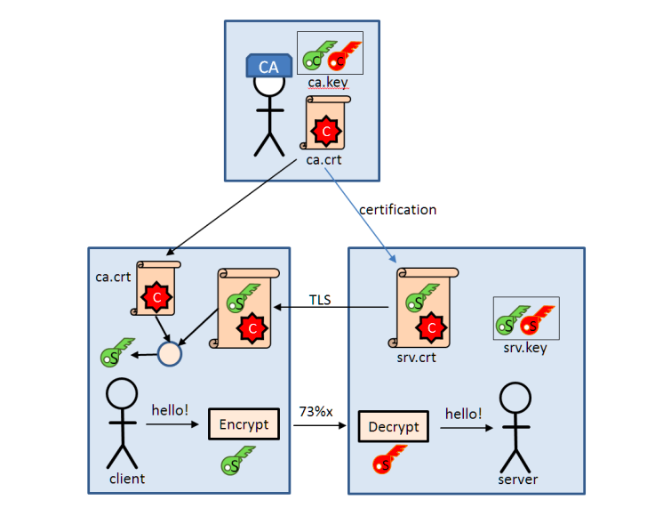
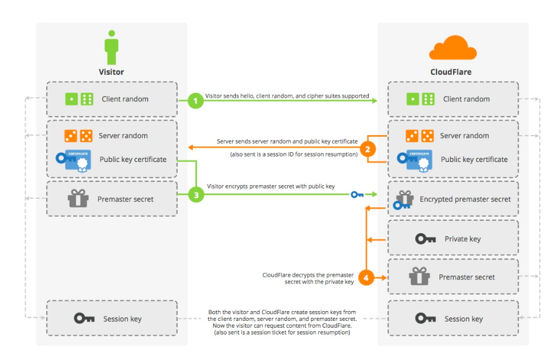

# INTERNET

> So whenever you make a connection to https://site.com , there's a lot going behind to make your connection secure. 
* Your browser get site.com's certificate which have its public key
* Your browser has to decide is the response really from site.com or someone trying to act as site.com
* If true then they generate a SECRET KEY only knows to them valid only for this session and every data they send is encrypted with this text


__So lets look how each of this component works__


## How Certificate works


* When you request to https://xyz.com , your system have to decide that weather the response is comming from legit xyz.com or someone is pretending to be xyz.com . Lets see how your computer/browser trust xyz.com.


* There are many trusted CA authority ex. `verasign, globalsign etc` which OS like `windows, MAC etc` trust already. Lets see internally how this trust happen
	* Verasign created a private key `private_vera.key` by `openssl genrsa -des3 -out private_vera.key 2048`. This is there private key they will use to make certificates.
	* Now they created a Authority certificate based on there private key by `openssl req -new -x509 -days 3650 -key private_vera.key -out verasign_test.crt` signed with there private key.
	* Now these certificates come preinstalled+preconfigured in OS's such as MAC/Windows who trust them. Any request/response to browser trust any certificate that are preconfigured in OS , so any website(xyz.com) who got there tls certificate signed by verisigned is trusted as OS trusts it.Now its verasign responsibility to issue certificates only to website that are legit and not `amazoon.com` but only `amazon.com`.

> **The above steps will create a `private_vera.key` and `verasign_test.crt`, this is now complete self certificate,meaning you can use this to self sign a csr(certificate signing request) request, install it on OS and any request using `verasign_test.crt` as signing authority will be trusted .**

* Now when a wesite like `xyz.com` want its certificate signed by verasign it will issue a certificate signing request (CSR) to versign . verasign will sign ur certificate if they find the website legit or you can just self sign it. Lets see how this signing happen
	* You as a website owner create a private key as done above and create a certificate signing request(csr) with your private key to CA authority like verasign or you can self sign it using the __verasign.crt__ you created above.(create a `private_xyz.key` and the make a csr `openssl req -new -out site.csr -key private_xyz.key`)
	* Now you can send this `site.csr` to verasign and they will investigate how legit your site is and site if they find it legit. Or now as u created your own CA certificate authoirty `verasign_test.crt`, you can just use that to self sign it (`openssl x509 -req -in site.csr -CA verasign_test.crt -CAkey private_vera.key -CAcreateserial -out site.crt -days 3650`) will create a `site.crt` which now site.com can use . If OS trust `verasign_test.crt`, i.e if they have this certificate preinstalled they will trust request comming from xyz.com.

	
## What is X509 certificates

* X509 certificate uses PKI(public key infrastructure) standards to verify how legit the public key is, does it belong to the authorized user or someone is faking it. It consists of:
	* components used in public key cryptography such as (e) and (n), that is the public key
	* the identity of party
	* signature of certified authority(CA) like verasign or self signed(verasign_test.crt as above)

* we can use `openssl x509 -in m2mqtt_ca.crt -text` to read the contents of a x509 certificate. 
```
Certificate:
    Data:
        Version: 3 (0x2)
        Serial Number:
            a1:c9:8a:66:08:ed:00:8d
    Signature Algorithm: sha256WithRSAEncryption
        Issuer: C=IN, ST=Some-State, O=Internet Widgits Pty Ltd
        Validity
            Not Before: Nov 18 09:19:18 2018 GMT
            Not After : Nov 15 09:19:18 2028 GMT
        Subject: C=IN, ST=Some-State, O=Internet Widgits Pty Ltd
        Subject Public Key Info:
            Public Key Algorithm: rsaEncryption
                Public-Key: (2048 bit)
                Modulus:
                    00:b6:b1:91:41:ed:ea:4d:cd:56:a2:ea:d1:e0:c2:
                    92:62:7c:2d:56:13:fb:5a:c6:46:f4:49:93:20:a9:
                    82:a8:27:27:ff:83:18:e7:f4:39:05:ad:dd:48:b6:
                    a0:48:9f:31:c1:73:9f:a9:8e:09:8a:7d:6e:c7:82:
                    58:22:7a:d9:e5:21:e2:99:19:59:a1:1e:fc:1a:ad:
                    07:2b:82:e7:22:8c:21:e1:e8:7a:42:2c:2c:5c:03:
                    7c:f6:45:7b:09:7d:51:38:dd:04:4d:21:c9:5a:93:
                    fa:1f:ff:cf:c0:10:63:d6:71:e6:c0:22:ad:48:68:
                    4f:4d:9e:fa:18:d5:da:8c:c2:3c:4a:a2:ef:6e:b2:
                    3f:64:64:2a:88:be:c1:61:69:0b:58:1e:01:9c:fa:
                    76:f3:da:65:c6:d4:f6:2b:25:f7:77:67:d9:92:6c:
                    79:e8:f7:d0:e8:7a:d0:07:bf:38:a0:24:ca:1c:63:
                    c5:c1:d1:58:5d:da:30:b4:d3:1f:04:04:46:06:a1:
                    a1:b3:55:6b:06:c1:ac:08:5b:5b:df:d1:a6:cc:7c:
                    b0:99:35:a2:b5:0f:eb:3b:e8:60:a1:ae:4b:7f:63:
                    c7:cf:38:13:9d:a5:e4:04:c7:8c:ac:1b:ce:be:61:
                    e5:b6:5b:c1:93:5d:94:ff:18:82:08:a8:98:74:ce:
                    55:b1
                Exponent: 65537 (0x10001)
        X509v3 extensions:
            X509v3 Subject Key Identifier: 
                BC:1E:2D:E8:A3:F3:12:B6:0F:AC:20:15:30:DC:04:18:49:2E:73:A3
            X509v3 Authority Key Identifier: 
                keyid:BC:1E:2D:E8:A3:F3:12:B6:0F:AC:20:15:30:DC:04:18:49:2E:73:A3

            X509v3 Basic Constraints: 
                CA:TRUE
    Signature Algorithm: sha256WithRSAEncryption
         3c:7c:f9:71:2b:8e:b0:83:ea:ea:e7:61:9d:07:d7:cb:49:53:
         d9:65:3a:72:dc:27:fe:aa:be:60:e9:cd:67:98:ce:24:1a:30:
         7d:ae:ab:d7:3e:ac:17:f6:ec:ab:2e:b2:5a:ee:a1:37:ae:97:
         17:8e:56:8d:7c:73:14:8c:3b:26:1c:08:44:db:69:1c:42:af:
         8f:e8:79:19:32:c1:c1:fa:b3:a2:97:4b:bd:16:0f:8c:2f:c7:
         77:41:0a:e3:0c:f7:94:cf:ee:d1:b5:f1:7b:ff:78:dc:2f:0c:
         37:73:b1:c1:f9:33:c8:d9:ea:e9:1e:16:5f:bf:de:77:2b:67:
         81:a3:26:36:c8:40:7a:28:57:2e:fc:d6:5c:9d:50:bf:3f:01:
         24:f5:80:f9:b0:37:7a:46:70:32:64:6a:99:72:55:82:b1:27:
         5c:b8:61:d0:0c:ba:03:7b:6a:4c:91:aa:00:f9:62:7b:13:c6:
         f7:53:69:8f:97:59:96:24:d5:84:70:cf:4b:50:50:0d:03:fb:
         99:43:65:3f:5c:72:1f:21:4b:52:47:1d:a3:fe:d8:a8:1f:d0:
         01:72:e8:5b:0a:f1:5e:e9:f7:29:9a:e6:d8:71:2c:d3:bb:01:
         b8:6d:26:50:7e:c4:e5:13:12:2d:8d:92:53:02:2d:b6:df:90:
         64:f2:2b:58
```
* Version – which X.509 version applies to the certificate (which indicates what data the certificate must include)
* Serial number – the identity creating the certificate must assign it's a serial number that distinguishes it from other certificates
* Algorithm information – the algorithm used by the issuer to sign the certificate
* Issuer distinguished name – the name of the entity issuing the certificate(`verasign,symantic etc`)
* Validity period of the certificate – start/end date and time
* Subject public key information – the public key associated with the identity
	* algorithm used(RSA in this case)
	* modulas used (n)
	* public exponent (e)

> Working 

* suppose xyz.com now have a verified certificate and now my browser wants to connect to https://site.com .
* I will send a request to site.com, for the first time, and it will send me its verified certicate for site.com. This certificate if signed by any CA authoity whos certicate is locally installed in my system, thus i will match `Signature Algorithm` in site.com certicate with any in my local os and if it mathces, means site.com is legit site.com verfied . So now i will have site.com's public key and as we know from now on, any data site.com will send can be encrypted with its private key and it can only be decrypted by its public key which i just recieced from its certificate.


## HOW RSA WORKS


## Going Deep



> __We are going to learn TLS handshake with RSA algorithm. This handshake can also be done using Deffie hillman algorithm which is some similar . refer document in this directory for learning how this handshake can be done with diffie hillman .__

so Objective is:

`Aman` want to talk to `https://site.com` 

* Aman makes a UDP request to its DNS to get IP of site.com
* Aman makes TCP-SYN request to site.com via its IP+HOST header(Host header is important as there can be mutiple websites running on same IP, i.e virtual hosting so host header to distinguish)
* site.com replies with SYN-ACK
* Aman makes ACK back to site.com

> up until now we have a TCP session established, time to do TLS handshake now

* Aman makes a TLS1.2 `client hello` request with a 32byte random number, accepted cipers suit, protocol version and compression methods
* site.com responses with 
	* TLS1.2 `server hello` response
	* 32 byte random number
	* ciper suit server will use to communicate
* site.com sends its `signed certificate` to Aman, which have his pubic key

> Now there is an optional step where server can demand for Aman's public key , usually this doesnt happen in https , but this can be server configured


* Aman generate a PMS(pre master secret key i.e 48-byte blob of data) and encrypt it with site.com's public key and send it to server, and server decrypt it using its private key .

> Now both Aman and server have these thing:
	* 32 byte random key generated by Aman and send to site.com (both have it)
	* 32 byte random key generated by site.com and send to Aman (both have it)
	* Both have same PMS key
	* server's public certicate

* All the 4 things are put into a algorithm to generate a symmertic key called `Master Key` which both Aman and Site.com generate at there end and is never shared on internet. bcz both party have eveything to make this Master key they can make it at there own workstation .Now This Master key will be used for encryption in furthur communication. 
* Now to verify that Master key is same on both end, Aman send some data encrypted with this key and if site.com can descrypt it, the TLS1.2 handshake is over.


> Mostly this master key is used as AES's key to encrypt data as it is most secure . some other symmertic key systems are tripleDES, RC4 etc which are not as secure.

> Cipher suite


* This is a unique identifier for combining algorithms making up a TLS connection. It defines one algorithm for each of the following:
	* key establishment (RSA or Diffie-Hellman variant)
	* authentication (the certificate type)
	* confidentiality (a symmetric cipher like AES)
	* integrity (a hash function)
	* For example 
		* “AES128-SHA” defines a session that uses:
			* RSA for key establishment (implied)
			* RSA for authentication (implied)
			* 128-bit Advanced Encryption Standard in Cipher Block Chaining (CBC) mode for confidentiality
			* 160-bit Secure Hashing Algorithm (SHA) for integrity
		* ECDHE-ECDSA-AES256-GCM-SHA384
			* Elliptic Curve Diffie-Hellman Ephemeral (ECDHE) key exchange for key establishment
			* Elliptic Curve Digital Signature Algorithms (ECDSA) for authentication
			* 256-bit Advanced Encryption Standard in Galois/Counter mode (GCM) for confidentiality
			* 384-bit Secure Hashing Algorithm for integrity


